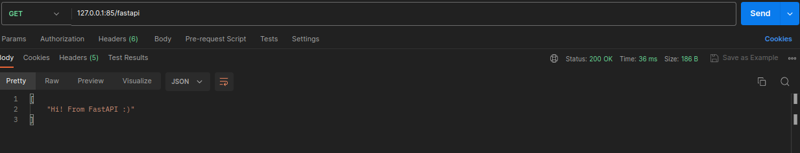
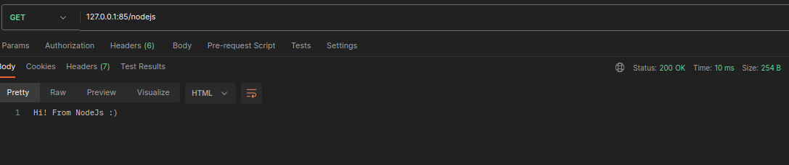

# API Gateway
## Tech Stack
 - Nginx 
 - NodeJS/express
 - FastAPI
## What is an API gateway
- Software that sits in front of an API.
- Acts as a single point of entry.
- Enters into a group of microservices.
Glue code for multiple APIs. <br>
[More](https://www.youtube.com/watch?v=-IBZGS_UXhU&t=1s)

## How!
### 1 - Create two APIs
---
- main.py
---
``` py

from fastapi import FastAPI
import uvicorn

app = FastAPI()

@app.get('/')
async def index():
    return {"Hi! From FastAPI :)"}

if __name__ == '__main__':
    uvicorn.run(app,port=8000)
```

```bash
pip3 install fastapi uvicorn # install fastapi and uvicorn packages
python3 main.py 
```
---
- index.js
---
``` js

import  express  from "express";

const app = express();

app.get("/",(request,response)=>{
    response.send("Hi! From NodeJs :)");
})

app.listen(8001, () => console.log(`API run on 8001`));

```
```bash
npm init -y # init js to create package.json
# copy this in package.json 
```
```json
 "name": "api-2",
  "version": "1.0.0",
  "description": "",
  "main": "nodejs.js",
  "type": "module",
  "scripts": {
    "start": "node index.js",
    "test": "echo \"Error: no test specified\" && exit 1"
  },
  "keywords": [],
  "author": "",
  "license": "ISC",
  "dependencies": {
    "express": "^4.18.2"
  }
```
```bash
npm install # install dependencies from package.json
npm start
```
---
### 2 - Configuring nginx
---
```bash
sudo nano /etc/nginx/sites-available/default # or nginx.conf file depends on what OS you use
```
- Set one upstream directive for each microservice

```
upstream fastapi{
    server 127.0.0.1:8000;
}
upstream nodejs{
    server 127.0.0.1:8001;
}

server {
    listen 85;

    location /fastapi/{
        proxy_pass http://fastapi/;
    }
    location /nodejs/{
        proxy_pass http://nodejs/;
    }
}
```

- restart nginx
---
```bash
sudo nginx -t # run test to check if nginx is ok to run
sudo systemctl restart nginx 
```
- Postman




